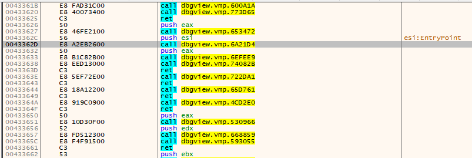
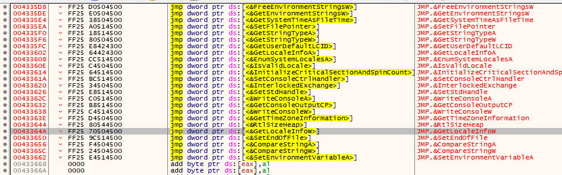
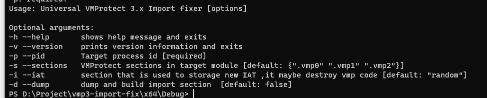
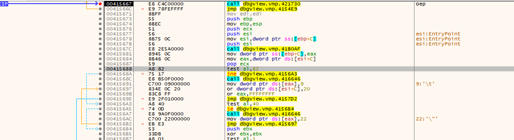
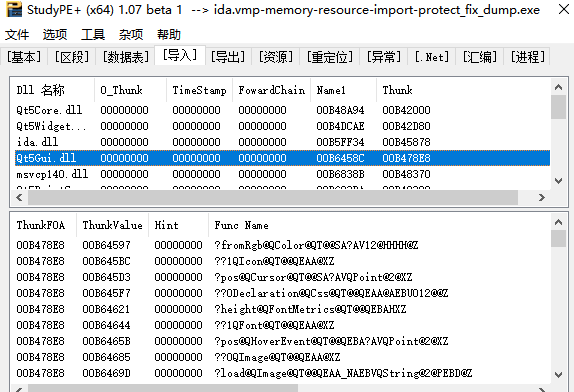
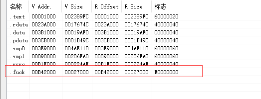
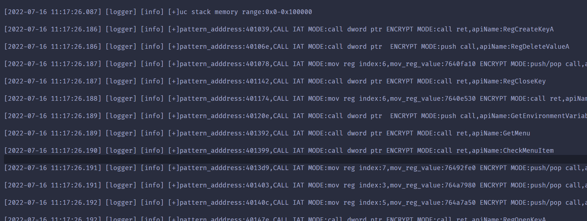
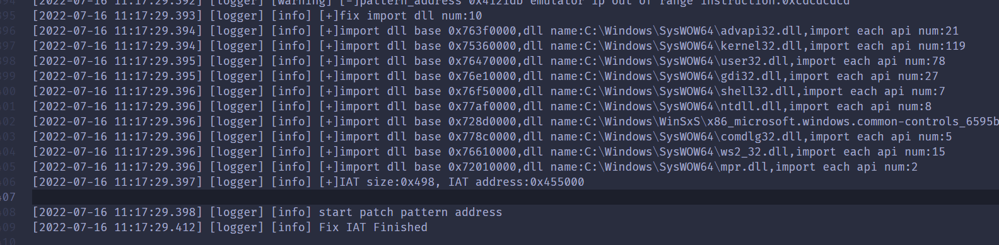

# VMProtect 3.x IAT Fix and Rebuild Import Table

This Program is a dynamic x86/x64 VMProtect 3. x import fixer（Tested on VMP3.3）. The main goal of this project was to build a correct and reliable tool to fix imports in x86/x64 applications.

Note: T**his tool can dump and rebuild import directory**. 

​	 **Fix the 32bit program please use the 32bit version, and vice versa**.


## Before



After



new IAT:


## Compile

VS2019

## Usage



**-Usage


**-p**: target process PID

**-s**:This tool first search call IAT address in sections,-s option specify ignore sections default [.vmp0,.vmp1,.vmp2]

**-i**: specify the section that is used to store IAT in memory, if you don't specify this option, this tool default will use **VirtualAlloc** to allocate memory that is used to store IAT content

**-d**: dump file and rebuild import table

Tips: **VMProtect unpacking must be complete before running this tool**,

Example:

when The target program reaches  OEP



execute this tool

 `.\vmp3-import-fix.exe -p 31652`

if you want to dump and rebuild import table

`.\vmp3-import-fix.exe -p 31652 -d`

if you want to  dump, rebuild import table , and fix the new IAT in .vmp0 section

`.\vmp3-import-fix.exe -p 31652 -d -i ".vmp0"`

below is the result that has dumped and fixed import table for **ida.vmp.exe**




new IAT section in the last section




you can see the  log file in log/logger.txt 






## VMProtect Encrypt IAT detail


VMProtect encrypts IAT through 3 modes

1. call ret or call int3 or call 0xXX
2. push call
3. pop call


### Call Ret mode


original code:

```asm
.text:0040D87E 50                              push   eax       *; hFile*

.text:0040D87F FF 15 1C C1 45 00               call   ds:FlushFileBuffers

.text:0040D885 85 C0                            test   eax, eax
```

encdrypt IAT

```asm
0040D87E | 50                         | push eax                                                   |
0040D87F | E8 47890B00                | call test1_vmp.4C61CB                                      |
0040D884 | C3                         | ret                                                        |
0040D885 | 85C0                       | test eax,eax                                               |
```

at address 0x0040D87F,code **`call   ds:FlushFileBuffers`** has changed to `call test1_vmp.4C61CB ;ret`


we follow encrypt IAT code,below codes analyze the process that VMProtect decrypts API Address

```asm
004C61CC | 55                         | push ebp                                                   |保存ebp
004C61CD | 0FCD                       | bswap ebp                                                  |
004C61CF | 66:8BE9                    | mov bp,cx                                                  |
004C61D2 | 66:BD F53D                 | mov bp,3DF5                                                |
004C61D6 | 8B6C24 04                  | mov ebp,dword ptr ss:[esp+4]                               |ebp=call返回地址
0048718D | 8D6D 01                    | lea ebp,dword ptr ss:[ebp+1]                               |ebp=call返回地址+1
0056A3E4 | 896C24 04                  | mov dword ptr ss:[esp+4],ebp                               |[esp+4]=call返回地址+1
0056A3E8 | 66:0F47EB                  | cmova bp,bx                                                |
0056A3EC | 0FBFED                     | movsx ebp,bp                                               |
0056A3EF | BD E6224000                | mov ebp,test1_vmp.4022E6                                   |
004B2DCA | 8BAD 432F0800              | mov ebp,dword ptr ss:[ebp+82F43]                           |
004BF11F | 8DAD C713DE73              | lea ebp,dword ptr ss:[ebp+73DE13C7]                        |
004F561B | 872C24                     | xchg dword ptr ss:[esp],ebp                                |恢复ebp，esp[0]=api地址
                                        ret                                                         |ret返回到Api
```


## Push Call  mode

original code

```asm
.text:004099DF 56                                                           push    esi
.text:004099E0 8B 35 0C C0 45 00                                            mov     esi,ds:InitializeCriticalSection
.text:004099E6 FF 35 A4 41 41 00                                            push    lpCriticalSection ; lpCriticalSection

```

encrypt IAT call 

```code
004099DF | 56                         | push esi                                                   |
004099E0 | 53                         | push ebx                                                   |
004099E1 | E8 299B1600                | call test1_vmp.57350F                                      |
004099E6 | FF35 A4414100              | push dword ptr ds:[4141A4]                                 | 004141A4:"@kA"
```

code `mov     esi,ds:InitializeCriticalSection` has changed to `push ebx  call test1_vmp.57350F` 


## Thanks

[unicorn](https://github.com/unicorn-engine/unicorn)

[BlackBone](https://github.com/DarthTon/Blackbone.git)

[vmpfix](https://github.com/archercreat/vmpfix)

[Scylla](https://github.com/NtQuery/Scylla)

[zydis](https://github.com/zyantific/zydis.git)

[spdlog](https://github.com/gabime/spdlog.git)	